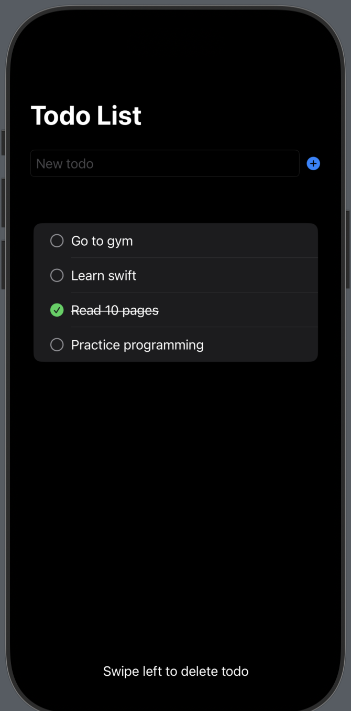

# SwiftTasks - iOS Todo App

A simple, elegant todo list application built with SwiftUI.

## Features

- ✅ Create, read, and delete todos
- 💾 Persistent local storage using FileManager
- 🎯 Mark todos as complete/incomplete
- 🗑️ Swipe to delete functionality

## Application Preview

 
Test Device: iPhone 16 Pro Simulator

## License
This project is licensed under the MIT License. See the [`LICENSE`](LICENSE) file for details.
